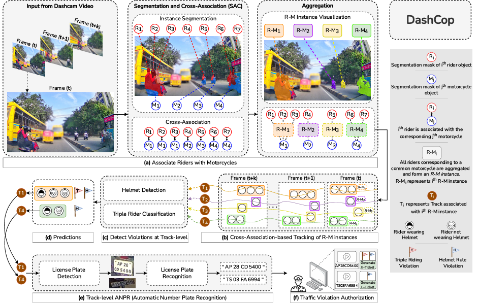

As shown in the figure, we have four major components in our methodology - Segmentation and Cross-Association (SAC) module, Cross-Association-based tracking module, Helmet/No-Helmet detection module and ANPR module. Navigate the corresponding repositories to understand the training procedure for these four modules.

